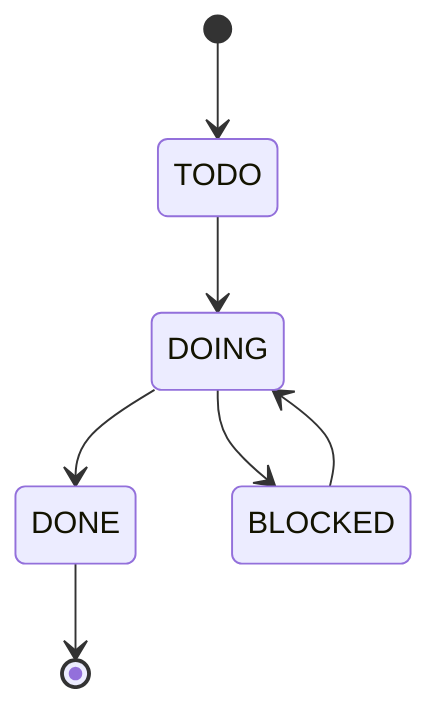

# STATECHART  (optional visual twin of PROJECT_LOG — same facts, as a picture)

Keep this in sync with PROJECT_LOG.md. Paste the diagram below into any Mermaid viewer
(or the Markdown preview) to see it. Simple task state model:

